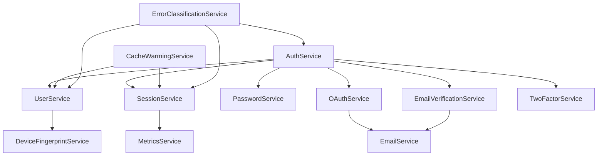

# AuthService - Services Documentation

## 📋 Overview

This document provides comprehensive documentation for all services in the AuthService microservice.

## 🏗️ Service Architecture

The AuthService follows a **Service Layer Pattern** with clear separation of concerns:

```
┌─────────────────┐    ┌─────────────────┐    ┌─────────────────┐
│   Controllers   │───▶│    Services     │───▶│     Models      │
└─────────────────┘    └─────────────────┘    └─────────────────┘
         │                       │                       │
         ▼                       ▼                       ▼
┌─────────────────┐    ┌─────────────────┐    ┌─────────────────┐
│     Routes      │    │   Middlewares   │    │   Database      │
└─────────────────┘    └─────────────────┘    └─────────────────┘
```

## 🔧 Core Services

### 1. **AuthService** (`auth.service.js`)

**Purpose**: Core authentication business logic
**Responsibilities**:

- User registration and login
- JWT token management
- Password hashing and validation
- Session management coordination
- Delegation to specialized services

**Key Methods**:

```javascript
-registerUser(userData) -
  loginUser(credentials, deviceInfo) -
  logoutUser(userId, sessionId) -
  refreshAccessToken(refreshToken) -
  verifyToken(token);
```

### 2. **UserService** (`user.service.js`)

**Purpose**: User management and profile operations
**Responsibilities**:

- User CRUD operations
- Profile management
- Activity logging
- User statistics

**Key Methods**:

```javascript
-getUserById(userId) -
  updateUserProfile(userId, profileData) -
  getActivityLog(userId, options) -
  createActivity(userId, activityType, details) -
  getUserStats(userId);
```

### 3. **SessionService** (`session.service.js`)

**Purpose**: Session management and tracking
**Responsibilities**:

- Session creation and validation
- Session lifecycle management
- Device tracking
- Security monitoring

**Key Methods**:

```javascript
-createSession(userId, deviceInfo) -
  validateSession(sessionId) -
  invalidateSession(sessionId, reason) -
  getActiveSessions(userId) -
  updateSessionActivity(sessionId);
```

### 4. **PasswordService** (`password.service.js`)

**Purpose**: Password-related operations
**Responsibilities**:

- Password validation and hashing
- Password reset functionality
- Password history tracking
- Security policy enforcement

**Key Methods**:

```javascript
-hashPassword(password) -
  validatePassword(password) -
  initiatePasswordReset(email) -
  resetPassword(token, newPassword) -
  checkPasswordHistory(userId, password);
```

## 🔐 Security Services

### 5. **JWKService** (`jwk.service.js`)

**Purpose**: JSON Web Key management
**Responsibilities**:

- JWT key rotation
- Public key distribution
- Key lifecycle management
- Security compliance

**Key Methods**:

```javascript
-generateKeyPair() - rotateKeys() - getPublicKeys() - validateToken(token);
```

### 6. **TwoFactorService** (`twoFactor.service.js`)

**Purpose**: Two-factor authentication
**Responsibilities**:

- TOTP generation and validation
- QR code generation
- Backup codes management
- 2FA enable/disable

**Key Methods**:

```javascript
-enableTwoFactor(userId) -
  verifyTwoFactorCode(code, sessionId) -
  generateBackupCodes(userId) -
  disableTwoFactor(userId, code);
```

### 7. **DeviceFingerprintService** (`deviceFingerprint.service.js`)

**Purpose**: Device identification and security
**Responsibilities**:

- Device fingerprinting
- Suspicious activity detection
- Location tracking
- Security risk assessment

**Key Methods**:

```javascript
-generateFingerprint(deviceInfo) -
  isUnusualLocation(devices, newLocation) -
  detectSuspiciousActivity(userId, activity) -
  updateDeviceInfo(userId, deviceInfo);
```

## 🔗 Integration Services

### 8. **OAuthService** (`oauth.service.js`)

**Purpose**: OAuth provider integration
**Responsibilities**:

- Google OAuth integration
- OAuth token exchange
- User profile synchronization
- OAuth account linking

**Key Methods**:

```javascript
-completeGoogleLogin(code, deviceInfo) -
  exchangeGoogleCode(code) -
  getGoogleUserInfo(accessToken) -
  findOrCreateGoogleUser(googleUser);
```

### 9. **EmailVerificationService** (`emailVerification.service.js`)

**Purpose**: Email verification management
**Responsibilities**:

- Verification token generation
- Email sending coordination
- Token validation
- Verification status tracking

**Key Methods**:

```javascript
-sendVerificationEmail(userId, deviceInfo) -
  verifyEmailToken(token) -
  resendVerificationEmail(userId, deviceInfo) -
  cleanupExpiredVerifications();
```

### 10. **EmailService** (`email.service.js`)

**Purpose**: Email operations abstraction
**Responsibilities**:

- Email sending abstraction
- Multiple provider support
- Email templates
- Delivery tracking

**Key Methods**:

```javascript
-sendEmail(emailData) -
  sendViaNodemailer(emailData) -
  sendViaSendGrid(emailData) -
  sendViaAWSSES(emailData);
```

## 📊 Monitoring & Performance Services

### 11. **MetricsService** (`metrics.service.js`)

**Purpose**: Performance monitoring and metrics
**Responsibilities**:

- Performance metrics collection
- Business metrics tracking
- Health monitoring
- Alert generation

**Key Methods**:

```javascript
-recordMetric(name, value, tags) -
  getMetrics(options) -
  initializeMetrics() -
  generateHealthReport();
```

### 12. **CacheWarmingService** (`cacheWarming.service.js`)

**Purpose**: Cache management and optimization
**Responsibilities**:

- Cache warming strategies
- Cache invalidation
- Performance optimization
- Cache hit rate monitoring

**Key Methods**:

```javascript
-warmUserCache(userId) -
  warmSessionCache(sessionId) -
  invalidateUserCache(userId) -
  getCacheStats();
```

### 13. **ErrorClassificationService** (`errorClassification.service.js`)

**Purpose**: Error handling and classification
**Responsibilities**:

- Error categorization
- Error reporting
- Error recovery strategies
- Debug information collection

**Key Methods**:

```javascript
-classifyError(error) -
  reportError(error, context) -
  getErrorStats() -
  generateErrorReport();
```

## 🔄 Service Dependencies



## 🚀 Usage Examples

### Basic Service Usage

```javascript
import { authService, userService, sessionService } from '../services/index.js';

// Register a new user
const user = await authService.registerUser({
  email: 'user@example.com',
  password: 'securePassword123',
  fullName: 'John Doe',
});

// Get user profile
const profile = await userService.getUserById(user.id);

// Create session
const session = await sessionService.createSession(user.id, {
  ipAddress: '192.168.1.1',
  userAgent: 'Mozilla/5.0...',
});
```

### Advanced Service Usage

```javascript
import {
  oauthService,
  twoFactorService,
  deviceFingerprintService,
} from '../services/index.js';

// OAuth login
const oauthResult = await oauthService.completeGoogleLogin(code, deviceInfo);

// Enable 2FA
const twoFactorSetup = await twoFactorService.enableTwoFactor(userId);

// Check device security
const isSuspicious = await deviceFingerprintService.detectSuspiciousActivity(
  userId,
  activity
);
```

## 🔧 Service Configuration

### Environment Variables

```bash
# Core Authentication
JWT_SECRET=your-jwt-secret
REFRESH_TOKEN_SECRET=your-refresh-secret

# OAuth Configuration
GOOGLE_CLIENT_ID=your-google-client-id
GOOGLE_CLIENT_SECRET=your-google-client-secret

# Email Configuration
EMAIL_FROM=noreply@bizpickr.com
SUPPORT_EMAIL=support@bizpickr.com

# 2FA Configuration
TWO_FACTOR_ISSUER=BizPickr
```

### Service Registry

```javascript
import { getService, getAllServices } from '../services/index.js';

// Get specific service
const authService = getService('auth');

// Get all services
const allServices = getAllServices();
```

## 📈 Performance Considerations

### Caching Strategy

- **User data**: Redis cache with 15-minute TTL
- **Session data**: Redis cache with 24-hour TTL
- **JWT keys**: Memory cache with 1-hour TTL
- **Metrics**: In-memory with periodic flush

### Database Optimization

- **MySQL**: For transactional data (users, sessions, passwords)
- **MongoDB**: For high-volume logs (audit, user activity)
- **Redis**: For caching and session storage

### Error Handling

- **Graceful degradation**: Services continue working even if dependencies fail
- **Circuit breaker**: Prevents cascade failures
- **Retry logic**: Automatic retry for transient failures
- **Fallback mechanisms**: Alternative paths when primary services fail

## 🔒 Security Considerations

### Data Protection

- **Password hashing**: bcrypt with 12 rounds
- **Token encryption**: AES-256 for sensitive tokens
- **Input validation**: Joi schemas for all inputs
- **SQL injection prevention**: Parameterized queries

### Access Control

- **JWT validation**: Strict token validation
- **Rate limiting**: Per-endpoint rate limiting
- **Device fingerprinting**: Suspicious activity detection
- **Audit logging**: Complete audit trail

## 🧪 Testing Strategy

### Unit Tests

- **Service methods**: Individual method testing
- **Error scenarios**: Edge case testing
- **Mocking**: External dependencies mocked

### Integration Tests

- **Service interactions**: Cross-service testing
- **Database operations**: Real database testing
- **External APIs**: OAuth and email testing

### Performance Tests

- **Load testing**: High-traffic scenarios
- **Stress testing**: System limits testing
- **Memory leaks**: Long-running tests

## 📚 Additional Resources

- [API Documentation](./../docs/api-documentation.js)
- [Database Schema](./../models/)
- [Middleware Documentation](./../middlewares/)
- [Testing Guide](./../tests/README.md)
- [Development Guide](./../DEVELOPMENT.md)
